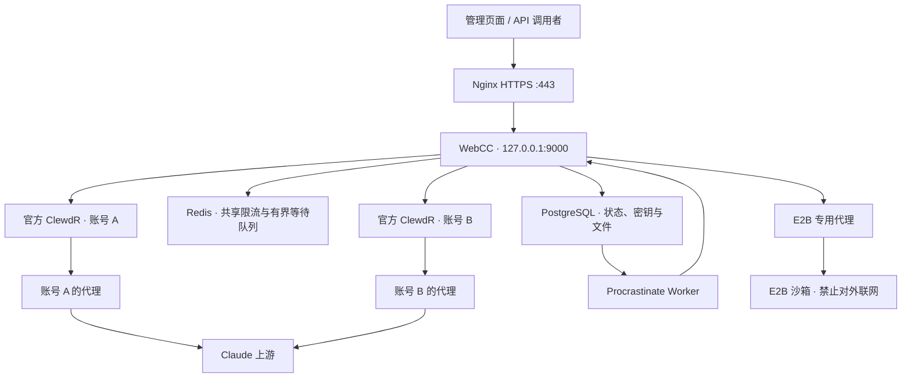

# WebCC

WebCC 是一个用于管理多个 Claude 网页账号的后台和 API 网关。你可以在页面里录入账号和代理，查看容器、出口 IP、有效期和请求情况，也可以通过一个平台密钥调用账号池。

每个账号独立运行官方 ClewdR 容器。客户端工具可按需使用同镜像、同代理的配置副本，仍共用单账号租约。WebCC 负责账号资料、容器管理、请求分配和版本更新；ClewdR 负责连接上游。两者分别维护，本项目没有修改 ClewdR 的源码。

本仓库从 2026 年 10 月 6 日服务器正在运行的项目导出。包含后端、前端源码、当时部署的静态页面、测试和部署配置。账号库、登录密码、sessionKey、代理凭据、证书私钥和历史备份保留在服务器，不进入 Git。

持久批量任务、E2B 执行、Skills 与程序化工具调用见 [持久任务架构](docs/DURABLE-RUNTIME.md)，对外接口见 [API 文档](API-PUBLIC.md)。

完整工具流程的模块边界、网页内置能力和后续验收见 [工具能力架构](docs/TOOL-CAPABILITY-ARCHITECTURE.md)。

## 架构

```text
backend/       后端代码、工具适配和前端构建产物
frontend/      React / MUI 前端源码
config/        不含凭据的环境配置模板
deploy/        安装、迁移和服务配置
requirements/  按运行组件划分的 Python 依赖
tests/         回归测试、合成样例和服务器验收入口
docs/          架构、运维与验收说明
```

根目录仅保留项目介绍、对外接口、待办和变更记录，以及 Git 配置。临时测试结果、历史方案和带密钥的交付文档保存在仓库外。



后端使用 Python，通过 Docker CLI 管理账号容器；持久任务采用 PostgreSQL 与 Procrastinate，执行环境使用 E2B 官方 SDK。前端使用 React、MUI 和 Vite。Nginx 提供 HTTPS，并将页面、管理接口和模型请求转发给 WebCC。账号容器使用随机本地端口，只有网关入口对外提供服务。

2026-10-08 生产已切换到 PostgreSQL 和 Redis。文件按当前部署选择保存为 BYTEA。中心调度保存持久占用，进程重启不会自动释放未确认结束的任务。节点 Agent 使用 Starlette、HTTPX 和 Uvicorn，目前在隔离环境验收，尚未启用跨服务器生产路由。迁移步骤见 [迁移与恢复](docs/POSTGRESQL-MIGRATION.md)，扩容边界见 [多服务器架构](docs/MULTI-SERVER-ARCHITECTURE.md)。

| 部分 | 职责 |
| --- | --- |
| `backend/manager.py` | 账号和凭据、代理检查、容器启停、平台认证、并发、请求转发和异常处理 |
| `backend/egress.py` | 账号容器代理出口白名单与启动前防火墙恢复 |
| `backend/updater.py` | 检查 ClewdR 官方版本、候选容器验证、逐个更新和失败回退 |
| `frontend/src/pages/` | 工作台、账号、资源、更新和 API 接入页面 |
| `frontend/src/components/` | 后台布局、账号表单、详情抽屉、凭据字段和复制组件 |
| `backend/static/` | 线上前端构建快照（2026-10-07 同步）；开发时由 Vite 重新生成 |
| `deploy/` | 安装脚本、systemd 单元、服务器 Nginx 配置和快照清单 |
| `tests/` | 单元与数据库回归；`support/` 保存合成文档，`live/` 保存需明确启动的服务器验收 |
| `docs/` | 架构、接口边界、部署维护和当前修复计划 |

## 当前服务器

下面的信息对应这次导出时的部署，不代表安装脚本会自动创建同样的服务器。

| 项目 | 当前配置 |
| --- | --- |
| 公网地址 | `165.154.205.213` |
| 系统 | Ubuntu 24.04 LTS，x86_64 |
| CPU | 2 个 vCPU |
| 内存 | 约 2 GB，系统可见 1965 MiB |
| 系统盘 | 约 58 GiB，导出时使用约 2.5 GiB |
| Swap | 未配置 |
| 管理页面 | https://165.154.205.213/ |
| API Base URL | `https://165.154.205.213/v1` |
| 后端监听 | `127.0.0.1:9000` |
| 项目目录 | `/opt/clewdr-manager` |
| 私有数据目录 | `/var/lib/clewdr-manager` |
| 环境文件 | `/etc/clewdr-manager.env` |
| systemd 服务 | `clewdr-manager.service` |
| HTTPS | Nginx，证书路径位于 `/etc/letsencrypt/live/165.154.205.213/` |
| 当前 ClewdR 提交 | `061c6d8ac9187148f50c8d806b56962a7f222b6c` |
| 当前镜像摘要 | `sha256:a598cc2954171913fe278ac6e4cedf8dfe6fe7a20437798362765676ed9e5813` |

详细的文件校验和、上游版本和非敏感运行参数见 [服务器快照](deploy/server-snapshot.json)。当前 systemd 配置见 [服务快照](deploy/server-systemd.service)，Nginx 配置见 [Nginx 快照](deploy/server-nginx.conf)。Nginx 快照包含全局配置上下文，迁移时应按新机器的文件布局拆分使用。

管理页面用 `CLEWDR_ADMIN_PASSWORD` 登录，模型接口用 `CLEWDR_PASSWORD` 调用。这两个密码用途不同；真实值从服务器环境文件管理，仓库只提供模板。

## 已实现的功能

账号页面采用表格和右侧抽屉，可以录入、导入和修改账号资料。抽屉提供代理连接串、邮箱凭据、sessionKey、UA、系统标签和容器详情，各项支持复制。敏感字段默认遮挡。

生产已启用账号出口白名单，代理故障不允许直连；新增账号要求固定公网 IPv4 代理。配置、迁移与验收见 [出口保护](docs/EGRESS.md)。

创建账号前会检测代理出口 IP 和 HTTPS 耗时。账号独立使用配置目录和代理。UA 与系统标签目前用于资料展示，没有替换 ClewdR 内置的请求指纹。

sessionKey 的默认预计期限按导入时间加 29 天计算。这是平台提醒规则，不是上游确认的实际 Cookie 有效期。账号到达填写或预计的期限后不再接收新请求；sessionKey 需要人工更新。

当前请求策略如下：

| 配置 | 当前行为 |
| --- | --- |
| 总并发 | 最多 4 个请求 |
| 每账号并发 | 1 个请求 |
| 等待队列 | 16 个，等待最多 15 秒 |
| 网关尝试 | 每个请求最多尝试 3 个不同账号 |
| 网关总预算 | 150 秒；单次连接和读取受 60 秒及剩余预算限制 |
| 连续故障 | 连续 3 次服务器或连接类失败后隔离账号 |
| 401 / 403 | 隔离，检查后人工恢复；不据此直接认定账号被封 |
| 429 | 冷却后重新参与调度 |
| 空回复 | 不作为成功返回，尝试其他资源；不单独计为隔离故障 |
| 已开始输出 | 不切换账号重放请求 |
| 上游更新 | 每 24 小时检查官方 master，候选验证通过后逐个更新 |

ClewdR 自身的重试与网关的不同账号重试是两个层次。现有账号配置保持 `max_retries = 5`、`skip_restricted = true`。其他账号配置以服务器各自的 TOML 为准。

更新验证失败时保留现有版本。官方镜像更新不会替换 WebCC 自己的 Python 代码或前端；管理平台需要通过本仓库单独发布。

## API 与当前边界

目前提供网页账号的 OpenAI 兼容聊天接口和 Anthropic Messages 入口。调用示例和模型范围见 [API 文档](API-PUBLIC.md)，错误策略见 [错误处理说明](docs/ERROR-HANDLING.md)。

WebCC 已提供客户端工具往返、文件管理、持久批量任务、Skills、MCP 和 E2B 执行。网页账号可能由上游自动选择模型；官方约束采样、模型端缓存和原生 Thinking 签名仍取决于上游能力。平台状态令牌和处理缓存分别用于历史校验和减少重复处理。

剩余工作与逐项验收要求见 [待办清单](TODO.md)。完成并验收后从清单删除，结果保留在 [变更记录](CHANGELOG.md)。

后续目标是让 Anthropic SDK 通过平台 Base URL 和平台密钥使用明确支持的功能，按模型及能力选择合适上游。方案见 Claude API 兼容计划（历史记录已归档）。

## 与外部项目的关系

| 项目 | 本项目如何使用 |
| --- | --- |
| [ClewdR](https://github.com/Xerxes-2/clewdr) | 实际运行的上游代理，每账号使用官方镜像。本仓库不是其 fork，没有修改上游源码 |
| [Sub2API](https://github.com/Wei-Shaw/sub2api) | 参考代理出口检测、并发与账号调度思路，没有部署它的数据库、计费或整套后台 |
| React / MUI / Vite | 前端实际依赖，版本由 `frontend/package-lock.json` 固定 |
| Docker / Nginx / systemd | 服务器实际使用的容器、HTTPS 和进程管理组件 |
| [LiteLLM](https://docs.litellm.ai/docs/pass_through/anthropic_completion) 等适配器 | 兼容方案研究对象，当前没有接入，不是运行依赖 |
| Anthropic | 当前账号连接的服务提供方，本项目是独立管理工具 |

## 构建和测试

需要 Python 3.11+。前端需要 Node.js 22.12+ 或其他满足当前 Vite 要求的版本。生产部署还需要 Linux、Docker、systemd 和 Nginx。

```bash
cd frontend
npm ci
npm run build
node test_accounts.mjs
cd ..
PYTHONPATH=backend python3 -m unittest discover -s tests -v
```

构建和单元测试不需要真实账号。真实生成测试会访问上游和消耗额度，应在隔离环境执行，并分别记录模拟和真实结果。

## 部署和版本维护

```bash
sudo bash deploy/install.sh
```

首次安装会创建 `/etc/clewdr-manager.env` 模板。填写两个不同的强密码后再次运行。脚本依赖已安装的 Docker，不负责配置 Nginx、证书或导入账号。部署前先生成 `backend/static/`，迁移时调整地址、证书路径和环境参数。

`server-baseline-2026-10-06` 标签保留最初导出的版本。2026-10-10 已发布 `d60e894`，完成公网工具、文件、引用及四并发复测。分支推送不会自动部署服务器。

安装脚本将 `backend/` 中的运行文件复制到 `/opt/clewdr-manager/`，沿用既有 systemd 启动路径。源码目录与安装目录分开，整理仓库不需要修改 ClewdR 或迁移账号数据。

源码回滚使用 Git，账号资料和运行状态使用服务器私有备份。代码回滚不能恢复 Cookie，也不能撤销已经执行的上游请求。具体步骤见 [开发与回滚](docs/DEVELOPMENT.md)，日常操作见 [运维说明](docs/OPERATIONS.md)。

## 工具调用与验收

工具适配由 WebCC 实现，独立于官方 ClewdR。共享逻辑在 `backend/web_tools/`，主网关负责鉴权、选号、取消和失败处理，客户端执行自己的业务工具。兼容范围和状态签名见 [API 文档](API-PUBLIC.md)。

[服务器验收](tests/live/README.md)说明真实测试的范围和启动条件；[修复验收](docs/FOREIGN-TRADE-REPAIR-ACCEPTANCE.md)保留当前结论与未完成项。仓库保留可维护的测试，不保存逐次原始响应、临时脚本、重复方案或带密钥的交付文档。历史记录已归档到仓库外，Git 历史也可追溯。
