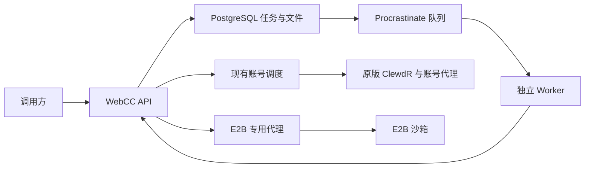

# 持久任务与沙箱执行

## 范围

每个密钥最多 16 个活跃任务与 512 个任务记录。批量输入展开上限 8 MiB。

批量任务、Skills 管理、代码执行和程序化客户端工具调用均由 WebCC 提供。模型仍使用已有网页账号，ClewdR 源码与镜像不作修改。E2B 提供执行环境，不提供 Claude 模型。

用量统计、精确 Token 计数、缓存命中统计及计费对齐不在本轮范围。网页通道未证明支持原生 Prompt Caching，不用本地缓存代替声明。

## 架构

| 模块 | 职责 |
| --- | --- |
| task_store.py | 所有者隔离、事务、执行锁、任务状态和 Skill 版本 |
| runtime_queue.py | Procrastinate 接入；队列只保存任务 ID |
| batch_tasks.py | 批量任务验证、逐项处理、取消与 JSONL 结果 |
| runtime_forward.py | 复用消息转发与账号调度，不存储调用方原始密钥 |
| runtime_api.py | 资源接口、权限和明确选择的 Messages 执行模式 |
| run_tasks.py | 执行状态机、工具结果关联、生成文件和清理 |
| e2b_runtime.py | 官方 E2B SDK 的适配层 |
| sandbox_runner.py | 仅在 E2B 运行的 Python 程序及异步工具桥接 |
| skill_bundles.py | 标准 SKILL.md 元数据、资源路径和版本快照 |

后台 Worker 并发为 1；消息调用受原有全局上限限制，并为实时请求保留一个账号并发位置。E2B 沙箱最多同时保留 2 个，包含等待客户端结果的任务。账号与沙箱限额由 PostgreSQL 协调；Worker 并发 1 是每个进程的设置。

HTTP 网关仍是当前线程服务。本轮没有同时重写语言或 HTTP 框架；跨服务器压测、节点控制与更新委派继续保留在独立计划中。

## 执行与恢复

程序通过异步函数调用声明的客户端工具。沙箱生成工具事件，网关校验工具名称和 JSON Schema 后返回 tool_use。调用方执行工具、提交 tool_result；沙箱恢复原进程继续计算，支持 asyncio.gather 的并行调用。

工具结果绑定调用密钥、运行 ID 和调用 ID。未知、重复、跨用户或已取消的结果不接收。等待时暂停沙箱，清理作业仍按平台期限执行；E2B 暂停本身不提供自动删除。

任务状态为 queued、processing、waiting、ended、failed、canceling、canceled、expired 或 unknown。进程中断后，无法确认是否已经启动的程序进入 unknown，不重跑整个程序。批量任务中的不确定单项记录 errored，继续处理其他未执行项。

未开始的取消直接生效。已发送的模型请求保留真实完成结果，取消阻止后续单项。沙箱取消会销毁执行环境；失败清理保留 cleanup_pending 并重试，资源不能提前标记已删除。

## Skills

上传采用 JSON files 映射；SKILL.md 使用 Agent Skills 的 YAML frontmatter。每个资源是 UTF-8 文本，最多 64 KiB；每包最多 64 项、合计 256 KiB。路径须规范化且不能越出 Skill 目录。

每次更新生成不可变版本，执行必须指定 skill_id 和 version。提交后保存该版本快照，后续更新不会改变已排队任务。选中的说明加入规划上下文，资源和脚本在沙箱内按需读取。脚本依赖必须已存在于 E2B 模板；运行时不开放网络安装依赖。

## 文件与隔离

最多 8 个输入文件，合计 20 MiB；最多 8 个指定输出文件。输出写在沙箱 output/ 目录，保存到原有 PostgreSQL Files，默认保留 24 小时。调用方通过既有下载与删除接口访问。二进制生成文件可下载，但不因此扩大普通 Messages 的可读文档类型。

E2B SDK 必须设置显式代理，不提供直连回退。沙箱默认禁止对外联网并关闭公开端口访问，不注入 E2B、Claude、代理或数据库凭据。仅上传选中的输入、Skill 和代码，调用方请求头不传给 E2B 或模型上游。

## 部署

1. 安装 requirements-runtime.txt 中锁定的依赖。
2. 使用 runtime_queue.build_app 配合 SyncPsycopgConnector，在目标数据库执行 schema_manager.apply_schema()；升级已有队列 schema 按 Procrastinate 迁移说明处理。
3. 私有环境配置 MANAGER_RUNTIME_ENABLED=true、E2B_API_KEY、MANAGER_E2B_PROXY；模板默认 base。
4. 安装 deploy/webcc-runtime.service，重启网关并启动 Worker。
5. 验证消息、任务、文件和取消流程后开放调用密钥的 batches、skills、runs 权限。

回退时先停止 Worker，再关闭运行开关并恢复代码；新任务表保留，避免覆盖回退期间的数据。存在活跃任务时先排空或取消并完成沙箱清理。

## 协议边界

Batches 使用 Claude 风格的资源接口。Skills 的 JSON 上传和 /v1/runs 是平台接口。Messages 的 E2B 执行必须显式设置 X-WebCC-Runtime: e2b-v1 和 model=webcc-runtime-v1，当前使用非流式响应；较长任务可返回 202，随后查询 /v1/runs。

该模式不会伪造官方 Thinking 签名、原生严格采样或上游缓存。完整官方 SDK 和具体应用兼容仍需独立验收。

## 参考与复用

- [Procrastinate 事务入队](https://procrastinate.readthedocs.io/en/stable/howto/production/external_connection.html)：任务和队列记录同事务提交。
- [Agent Skills 规范](https://agentskills.io/specification)：采用标准说明和资源结构。
- [Claude 程序化工具调用](https://platform.claude.com/docs/en/agents-and-tools/tool-use/programmatic-tool-calling)：采用执行调用关联与等待结果的流程。
- [E2B 官方 SDK](https://github.com/e2b-dev/E2B)：复用执行、文件、代理、暂停恢复和销毁。
- [E2B 暂停与生命周期](https://docs.e2b.dev/sandbox/persistence)：暂停保留进程，平台自行管理保留期限。

没有复制第三方文档处理 Skills；用户上传的脚本自行选择与管理。
