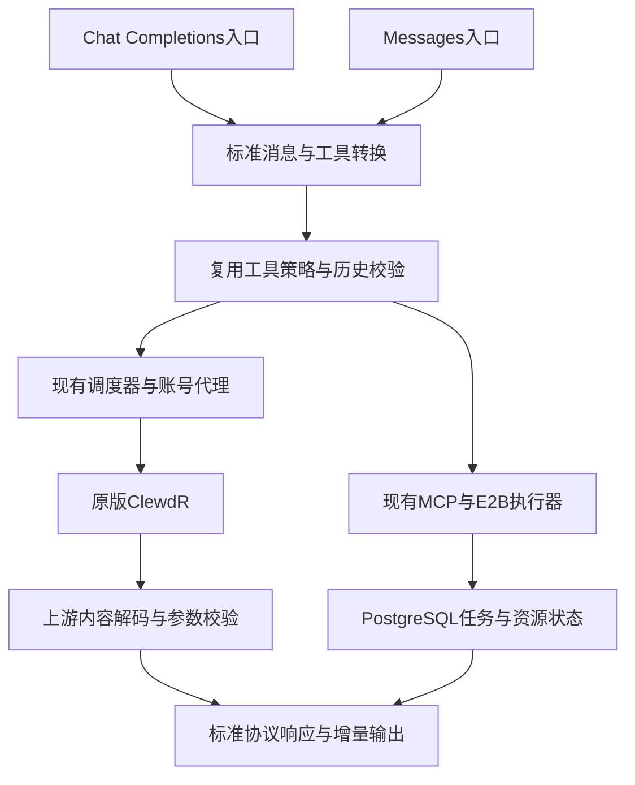

# 外贸业务测试后的修正方案

2026-10-10。状态：实施与候选复测中。依据：[测试报告](FOREIGN-TRADE-ACCEPTANCE.md)、[异常清单](FOREIGN-TRADE-ISSUES.md)及当前代码。修复代码、候选与真实账号验收均在 WebCC 内完成；生产发布状态以验收报告为准。

## 1. 判断依据

49个公网多步会话完成36个，11个出现工具协议错误。一个具体封装错误已在隔离环境复现；其他失败不能直接归为同一原因。多账号分配、长文档局部修改、CRM版本冲突恢复和取消释放已有成功记录，应继续复用。

用户提供的仓库是对Claude Code客户端的公开静态分析。它可以帮助理解执行与恢复设计；网页模型和官方API的底层能力需要分别验证。分析中的缓存、模型预算和私有实现不能直接作为WebCC上游支持证据。本方案不引入该仓库源码或新的Agent框架。

采用的参考思路：

- 工具输入校验、执行、错误结果回传分层；按操作是否可安全并发调度。见[工具执行分析](https://github.com/liuup/claude-code-analysis/blob/main/analysis/04b-tool-call-implementation.md)。
- 长上下文处理后仍保留当前文件、任务及工具状态。见[上下文分析](https://github.com/liuup/claude-code-analysis/blob/main/analysis/04f-context-management.md)。
- 恢复必须保留并行工具结果配对。见[会话恢复分析](https://github.com/liuup/claude-code-analysis/blob/main/analysis/04i-session-storage-resume.md)。

具体请求、响应和异常以Claude官方文档为准，实施逻辑根据WebCC自己的接口与实测记录独立设计。

## 2. 推荐架构

Python继续承担协议和执行编排；PostgreSQL持久保存任务与资源，Redis复用现有队列和并发协调。此次CPU负载较低，主要障碍在入口、解码、环境与等待体验，尚无证据支持更换语言。后续扩容通过复制网关/执行节点并使用共享存储协调；保留当前全局4、单账号1的限制完成可靠性复测后，再单独验证提高容量。

两个入口转换为同一套语义，避免各写一套工具规划、校验和重试。客户端工具由调用方执行；MCP/E2B等平台工具由已有服务端执行器执行。API不能自行读取客户电脑文档，也不能替客户应用保证其写操作幂等。

## 3. 问题、原因和方案

| 顺序 | 问题 | 证据和原因可信度 | 推荐措施 | 改动与边界 |
|---|---|---|---|---|
| A1 | 默认Chat Completions没有工具调用 | 已实测；manager.forward仅为Messages分派工具 | 新增薄协议转换，将声明、选择、历史及结果转换到现有工具入口，再转换回OpenAI响应 | 中等；不能仅改URL，流和非流都要覆盖 |
| A2 | 有效业务参数因封装错误中断 | 隔离复现一次：空text位于call内，根对象缺text | 对实测的空字段、重复同值名称及已知工具块元数据归一化，说明文本完整保留；在同一解码逻辑中继续严格检查真实输入 | 小到中；不得猜参数、改参数类型、删除非空文本或任意未知字段 |
| A3 | 内部封装禁止文本与工具混合 | 代码确认，属于兼容性限制，未证明是其他11次失败的原因 | 允许说明文本与工具内容共存，明确顺序、结束原因与历史回传 | 中等；复用现有封装，不另造公开协议 |
| A4 | 流已输出后才发现整轮封装有误 | 实测出现HTTP200后SSE错误；客户端可能在工具块结束后执行 | 工具完整参数校验后才结束工具块；全轮解码与增量解码保持一致；结束后异常不能自动重放 | 中等；某些真实客户端的副作用边界仍需验证 |
| A5 | 错误原因粗糙、账号故障与输出错误容易混淆 | 输出校验异常被合并；ccb1原因只细分到HTTP/transport | 区分入参、封装、参数、模型截断、节点、代理、上游、沙箱和排队；保留脱敏请求ID与阶段时序 | 小到中；当前输出校验分支没有给账号累加失败，需保持这一点；不自动恢复隔离账号 |
| B1 | E2B缺pandas，普通数据分析失败 | 实测且默认模板base可确认 | 固定受控模板，预装最小办公依赖，声明环境能力并在执行前检查 | 小到中；沿用已有MANAGER_E2B_TEMPLATE配置，不开放运行期互联网安装 |
| B2 | CSV默认媒体类型上传不方便 | 实测text/csv报错；官方允许CSV以text/plain上传 | 上传层对UTF-8 CSV明确规范化类型，保留文件名；计算走container_upload | 小；这是易用性扩展，不能说官方Files一定原生接受text/csv |
| B3 | 联网答复缺可核验引用 | 实测无标准引用；独立抓取失败，但具体代理/HTTP原因未定位 | 先记录并定位抓取原因；透传已有真实搜索事件，对可取得原文的来源复用引用定位器 | 中等；来源不可读取就保留来源失败，不能拼造引文或伪造官方加密内容 |
| C1 | 长资料被128KiB内部界限拒绝 | 代码确认bounded_json；不是已证实的模型窗口极限 | 分开资源体积与提示体积限制；先做清晰错误与范围读取，完整历史摘要作为显式会话功能后续验证 | 中等；普通API不静默压缩客户原始消息 |
| C2 | 8员工组长等待和排队失败 | 首内容P95 16.67秒、任务P95 73.01秒 | 拆分排队、模型、工具、回读耗时；并行独立读取，保留写入版本检查；展示实际已有进度 | 中等；不承诺时间比例，不向标准流塞不兼容进度事件 |
| C3 | 文档ID误用、性能误写、CTA不全、受众混淆 | 已观察；其中对客成本混入也源于测试提示要求合并 | 改善工具描述/资源发现，业务测试中明确产品事实、输出受众及独立文案结构 | 客户端和业务模板为主；通用网关不硬编码外贸规则或更改所有客户提示 |

### A1：标准入口的具体映射

| OpenAI侧 | 内部采用的Messages语义 |
|---|---|
| tools[].function.parameters | tools[].input_schema |
| assistant.tool_calls | assistant内容中的tool_use，保留ID、名称与参数 |
| role=tool与tool_call_id | user内容中的tool_result，保持原工具配对 |
| tool_choice及parallel_tool_calls | 对应选择策略及并行限制，不静默忽略 |
| choices[].message.tool_calls | 同一已校验调用转换为function.arguments字符串 |
| 增量delta.tool_calls | 按index与ID累计参数分片，输出规范结束原因 |

普通聊天继续使用现有快速路径；只有需要转换的请求进入工具适配。对不同协议无法无损表达的扩展单独核对；响应格式一致不代表所有模型端能力等价。

官方客户端工具循环由模型提出tool_use、客户端真实执行、客户端回传tool_result构成；执行失败可带is_error回传。见[官方工具结果处理](https://platform.claude.com/docs/en/agents-and-tools/tool-use/handle-tool-calls)。网关不会替客户端编造成功结果。

### A2—A4：可靠性与速度的取舍

归一化仅处理已复现的空字段形式。例如工具调用存在、根text缺失、call上的text均为空、无其他未知字段时，移除这些空辅助字段并补根text=""。业务input保持原样。之后仍校验名称、选择策略、JSON Schema与历史配对。

缺必填业务参数、错误类型、未知工具、重复JSON键、截断JSON都不能靠这个规则修复。输出开始前可以有限纠正模型格式；工具调用一旦对客户端完整输出，或服务端动作开始执行，禁止从头重试整轮。按工具ID与已执行状态恢复；执行结果不确定时先查询和对账。外部系统不提供幂等键或结果查询时，不能声称具有严格的恰好一次执行保证。

普通工具参数保留增量；strict 调用先完成单个调用的参数和封装校验，再发布调用，供客户端执行。Thinking 在封装可用前暂存，输出前仍可纠正格式。此前已完整输出的调用不能因后续封装错误被改写或重复。真实文本增量继续立即转发；不能把等待整轮结束后的切块当实时生成。官方细粒度工具流也要求调用方处理不完整JSON，见[官方工具流](https://platform.claude.com/docs/en/agents-and-tools/tool-use/fine-grained-tool-streaming)。

结构化最终答案要求严格Schema时，应完整校验后再完成响应；可以降低不合法结果风险，但增加等待。只用网页账号，无法补出官方的约束采样。拒答和max_tokens应保留真实停止原因，不能包装为成功JSON。见[官方结构化输出](https://platform.claude.com/docs/en/build-with-claude/structured-outputs)。

### B1—B2：办公沙箱

第一版依赖建议固定pandas、openpyxl、pypdf及已有代码执行组件，按实际任务补充，不直接复制全部官方环境。确认SDK/Python兼容版本，构建模板、启动验收后固定模板ID。E2B支持预配置模板，见[模板文档](https://docs.e2b.dev/template/quickstart)。WebCC已有模板选择、代理和断网设置，可直接复用。

代码执行开始前检查必需依赖，给模型提供实际环境清单；不可在部分代码已经执行后盲目安装并整段重跑。保留文件归属、沙箱断网、超时销毁和退出清理。模板构建与运行成本单独核对，尚不能给出具体节省比例；不增加新的服务商。

官方代码执行预装pandas等数据与办公库，见[执行环境](https://platform.claude.com/docs/en/agents-and-tools/tool-use/code-execution-tool)。官方Files说明CSV可按text/plain读取，数据计算可通过container_upload使用，见[文件协议](https://platform.claude.com/docs/en/build-with-claude/files)。

### B3：来源可核验

实测确认代理按域名可读取 Google 官方页，本机 DNS 固定地址不能连接；正文也超过原 1 MiB。已改为通过同一代理解析并固定公开地址，抓取和子进程均采用 2 MiB 上限，继续复用有界提取、缓存及引用定位。

网页已提供的真实结果块和引用优先透传，保留多轮状态。平台抓取原文时复用document_citations.py进行准确定位；逐字匹配能验证引用存在，但不能单独证明观点必然由引用推出，还需业务验收。缺正文时可以返回真实链接及来源状态，不能生成“已验证”的引文。

官方搜索默认有引用；抓取引用需要启用。见[搜索协议](https://platform.claude.com/docs/en/agents-and-tools/tool-use/web-search-tool)、[抓取协议](https://platform.claude.com/docs/en/agents-and-tools/tool-use/web-fetch-tool)。只用网页通道不能保证每次返回这些完整原生块。严格次数和域名控制继续按用户此前决定暂缓，不重新要求开通Brave。

### C1—C3：上下文与业务内容

优先让文档工具提供稳定ID、分页/范围读取、片段检索和局部修改，返回版本与真实错误。大型文档留在资源存储中，按需读取。若要自动摘要，应成为明确的会话模式，保留原始历史和摘要版本、未完成工具调用、最近结果、文件版本、已执行动作及来源；不能悄悄改变普通Messages语义。官方也区分上下文编辑与摘要压缩，见[上下文编辑](https://platform.claude.com/docs/en/build-with-claude/context-editing)。

外贸验收明确：每条社媒脚本均有询盘CTA；MOQ、交期和认证来自产品资料；对客报价不出现供应商成本；库存/CRM工具使用真实资源ID。这些归入测试和可选业务配置。网关继续对其他客户保持通用。工具描述和可操作错误可提升真实执行可靠性，见[Anthropic工具设计建议](https://www.anthropic.com/engineering/writing-tools-for-agents)。

## 4. 官方能力与可实现边界

| 内容 | 此方案能做到的程度 |
|---|---|
| 工具声明、选择、历史、结果及标准流式 | 继续提高两类客户端协议兼容性，真实往返逐项验证 |
| 参数与JSON可靠性 | 本地校验和有限纠正；无法获得官方约束采样的同等保证 |
| 文件、运行、MCP任务与资源 | 使用既有平台能力；接口兼容程度以SDK和真实流程为依据 |
| 搜索、抓取、文档引用 | 有真实结果和原文时可适配；网页通道未提供的原生加密字段不能凭空补出 |
| 精确模型选择 | 当前网页通道实测存在型号映射，此轮无法承诺精确选择 |
| Thinking签名、模型端Prompt Caching | 不能由Claude Code客户端源码获得官方服务端能力；保留真实上游块/签名，平台状态及处理缓存分别说明 |

## 5. 分批实施与复测门槛

| 批次 | 内容 | 必须取得的证据 |
|---|---|---|
| 第一批 | A1—A5：入口、解码、混合内容、增量一致性与故障分类 | 原始失败样本通过；OpenAI/Anthropic SDK的流/非流均完成工具往返；非法参数不执行；工具块后断流不重复动作 |
| 第二批 | B1—B3：沙箱、CSV、来源 | 普通CSV上传、真实分析、下载和删除；沙箱不需人工提示避开缺包；来源失败明确，成功引用可核对 |
| 第三批 | C1—C3：上下文、等待、业务质量 | 保留原49任务失败记录，对同一岗位集复测并增加未见样例；来源/产品事实人工复核；并发1/2/4/8保留所有请求时序 |

建议每档8任务至少重复3轮并交错执行档位，避免把固定顺序、账号状态或偶然输出当并发结论。这个样本仍不能证明长期SLA。报告分别记录完整任务成功率、保存结果准确率、内容可用性、首个有效内容、首段可读文本、排队、模型、工具和全任务耗时。精确计费与Token用量继续排除。

机械协议和已知复现样本要求全部通过；真实业务若出现任一工具中断、重复写入或错误产品事实，保留为异常并分析，不以平均速度掩盖。先用服务器候选环境与挂载账号测试，保留基线，分批小提交；达到对应门槛才部署。实际WorkBuddy和原生Word格式验收单独记录，不能用SDK模拟代替。

## 6. 本次建议核对

1. 先修第一批，再做第二、三批；全部在WebCC内实现，ClewdR继续使用原版。
2. 沿用Python、PostgreSQL、Redis和E2B，暂不更换语言、不新增执行框架、不提高并发上限。
3. 网关处理通用协议与执行可靠性；外贸事实、CTA及对客/内部受众分离纳入业务模板和测试，避免污染所有用户请求。

候选首轮 61/96、第二轮 81/96 完成；第三轮完成样本 23/24，第四轮 22/23。后两轮发现具体协议问题后停止，未完成任务不计作成功。失败记录保留，分别修复纠正信息不明确、标准 text 内容块混入 calls 的解码问题。当前复测版本包含完整参数校验、Thinking 暂存、共享 FIFO，以及流式/非流式有序内容解析；生产仍保留发布前版本。
