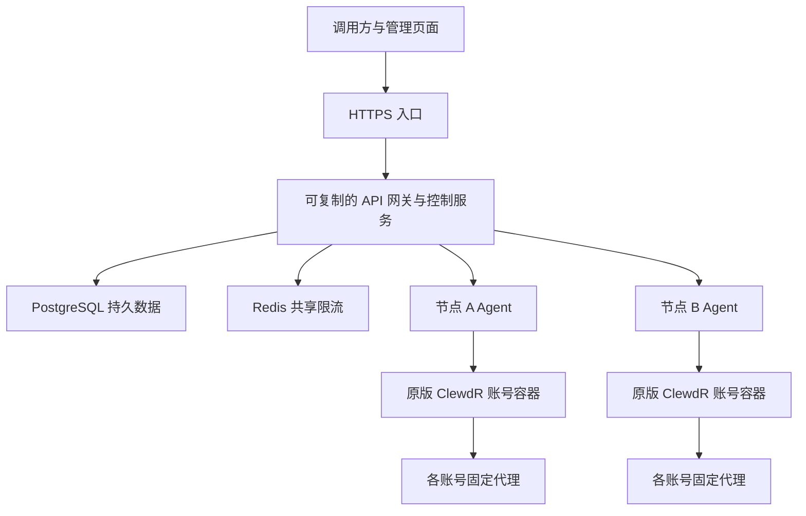

# 多服务器架构方案

日期：2026-10-08。状态：PostgreSQL 与 Redis 已于 2026-10-08 切换生产，节点 Agent 与跨服务器链路仍待实现。PostgreSQL 与 Redis 已在服务器以独立容器运行，只绑定本机地址。通用回归和数据库专项分别记录，不将候选测试当作生产发布。

## 当前实际限制

当前 manager.py 同时提供 HTTP 服务、鉴权、账号分配和本机 Docker 管理。registry.json 保存账号和调用密钥；threading.Condition、内存计数和速率窗口只在一个进程内有效。SQLite 当前主要保存上传文件的元数据及字节，并非全部业务数据。

将现有程序启动多个副本会导致账号占用、并发额度、限流窗口和文件视图彼此独立。仅增加服务器、仅换数据库或仅换 HTTP 框架，都不能解决这个问题。

## 推荐结构

网关和控制逻辑初期放在同一项目的独立模块中；按部署角色启动，不立即拆成大量微服务。节点 Agent 只管理本节点容器、健康检查与请求执行。节点按能力注册，账号归属明确；默认禁用账号容器直连上游，保留已有代理白名单。

## 技术选择

| 部分 | 建议 | 原因 |
| --- | --- | --- |
| 生产网关与分布式调度 | Go 候选，先与 Python ASGI 基线压测比较 | 适合长期连接、流式转发和取消；简单发布为单个二进制。实际优势由压测确认 |
| 现有网页工具适配 | 先保留 Python 模块 | 已有实际验收，重写前使用同一协议测试；避免迁移破坏已验证行为 |
| 节点 Agent | 初期复用 Python，后续视运维需求统一 Go | 容器管理不是优先性能瓶颈；分离节点职责比立即换语言重要 |
| 中心业务数据 | PostgreSQL | 账号、节点、密钥、权限、配额、资源归属、运行状态与幂等记录统一持久化 |
| 请求速率窗口 | Redis | 使用服务端时钟和 Lua 原子操作；不可用时拒绝请求 |
| 文件内容 | PostgreSQL BYTEA | 按用户选择先统一保存文件，保留 ID、归属、到期时间和原字节；后续大文件独立迁往对象存储 |
| 前端 | 保留 React/MUI，可逐步使用 TypeScript | 无需为后端扩容重写界面 |

Python ASGI 同样能实现多服务器服务，不能未经压测断言 Python 不够用。现有标准库线程 HTTP 服务不是最终集群网关形态。Go 迁移优先覆盖转发、调度和取消路径，不同时重写所有工具功能。

## 分布式正确性

- 并发上限分别配置为调用者、模型/能力、账号、节点、全局；账号上限依据实测，不由服务器数量自动放大。
- 分配账号与占用额度需要原子操作；使用唯一租约标识、续约和只释放自身租约。节点失联后仍可能存在上游请求，不能只凭 TTL 过期就认定资源已空闲。
- 节点应确认取消和任务终止；状态不确定时将账号置于待核实状态，防止重复分配。过期令牌不能接受新的任务。
- 请求有界排队；超过容量或期限明确返回 429/503。不能靠无限队列或无限线程提高吞吐。
- 流开始后不盲目换账号重放；工具产生副作用后保留执行状态与幂等记录。不能承诺网络故障下无条件“恰好一次”。
- PostgreSQL 为持久事实来源；Redis 数据丢失后从持久状态与节点实际任务重建。协调服务不可用时拒绝无法安全分配的新任务，不退回互不知情的单机调度。
- 运行容器、文件、技能产物与任务均绑定调用者；凭据不进入模型内容或公开日志。
- 节点通信只经私网或认证加密通道；不公开 Docker socket、账号容器端口或数据库。保留原版 ClewdR 升级与隔离回归流程。

## 迁移步骤

1. 先建立不依赖本地文件和进程变量的存储、调度、节点执行接口；保持现有对外 API。
2. 将账号与密钥从 registry.json 导入 PostgreSQL，将文件元数据和内容迁入 PostgreSQL/对象存储。核对条数、归属、摘要和原字节，保留回滚快照。
3. 引入共享限流和租约，实现两节点调度、节点下线和状态恢复；SQL/Redis 操作不得发生在整段 SSE 转发的长事务中。
4. 比较 Python ASGI 与 Go 网关在相同资源、协议及负载下的表现，再确定核心语言迁移范围。
5. 小流量切换；验证撤销密钥、文件隔离、长流取消、故障和升级，达到门槛后扩容。

## 验收门槛

同一负载、同一资源限制、同一上游模拟器比较 QPS、活动流数量、首字节及尾延迟、RSS、CPU、连接数、文件描述符、错误和队列拒绝率。模拟慢流、断网、取消、节点崩溃、Redis 重启、网关滚动重启及代理故障。测试必须覆盖同一账号不会被跨节点重复占用、撤销及时生效、文件跨节点可读取且不跨用户泄露。

真实网页账号用于有限的端到端验收，不能用账号限额证明网关吞吐，也不能把模拟压测结果称为真实账号容量。生产容量同时受账号额度、代理质量、模型响应时间和节点资源限制。

## 参考

- [SQLite 官方适用范围](https://www.sqlite.org/whentouse.html)
- [SQLite 网络使用限制](https://www.sqlite.org/useovernet.html)
- [FastAPI 部署与进程内存](https://fastapi.tiangolo.com/deployment/concepts/)
- [Go 并发模型](https://go.dev/doc/effective_go#concurrency)
- [Redis 租约与分布式锁约束](https://redis.io/docs/latest/develop/use/patterns/distributed-locks/)
- [Sub2API 部署结构](https://github.com/Wei-Shaw/sub2api/blob/main/deploy/DOCKER.md)

参考现成网关的调度、持久存储和限流设计，不直接把其他项目的功能或容量声明当成本项目已具备的能力。

## 本轮实现边界

已部署代码用 PostgreSQL 按实体保存账号、密钥和更新配置；字段级比较避免旧快照覆盖其他实例的修改，同字段冲突明确拒绝。账号占用使用独立的持久记录与随机令牌，只能释放自己的记录。数据库故障或进程异常后占用不会自动过期，恢复前必须核实旧任务。该选择优先防止重复分配，故障恢复需要运维处理。

Redis 使用服务端 TIME、滚动 60 秒窗口和 Lua 原子操作。账号全局并发配置集中保存，不允许另一个实例通过不同参数放大上限。节点管理操作使用 PostgreSQL 会话锁，账号 session_hash 由唯一索引约束。

当前只验证同一服务器上的多个进程，未完成独立节点 Agent 和真实跨服务器验收。标准库 HTTP 服务暂时保留，未完成 ASGI/Go 在相同负载下的对比，因此不声明语言改造已经完成。原版 ClewdR 代码与镜像没有修改。
